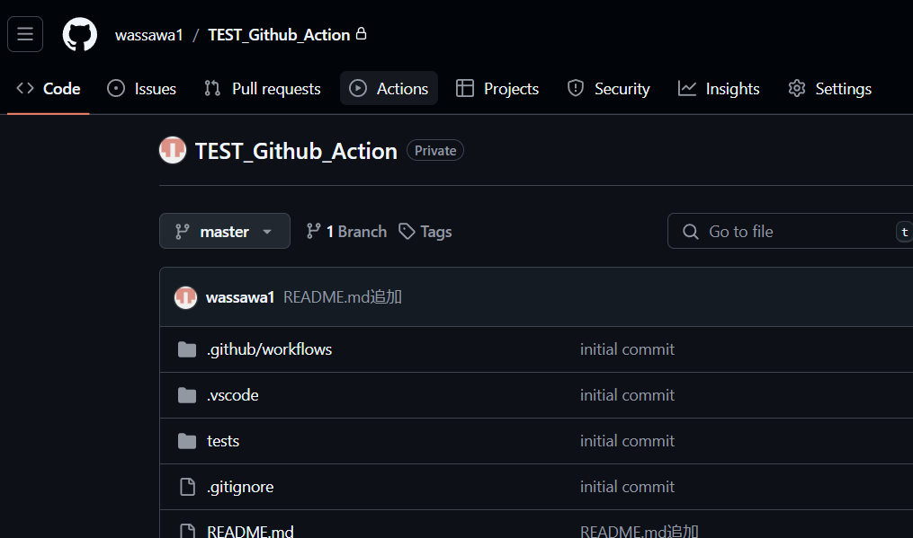
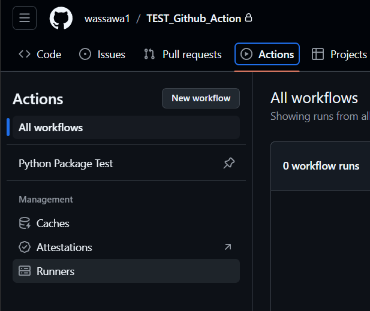
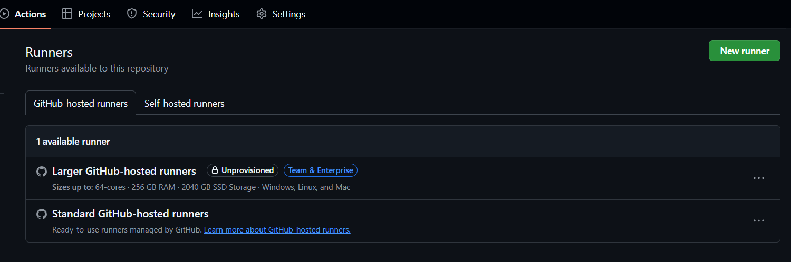
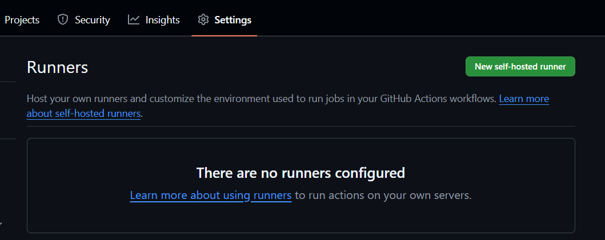
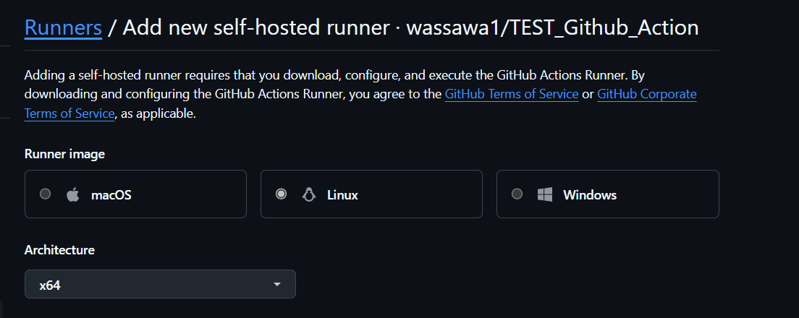

# Github Action を使ってみるリポジトリ

* 設定方法
```./.github/workflows/*.yml```を配置(今回は```test.yml```)という名前。

今回は下のものを用意。まだ動作確認できていないため注意

```yml:test.yml
name: Python Package Test

on:
  push:
    branches:
      - ${{ env.BRANCH_NAME }}
  pull_request:
    branches:
      - ${{ env.BRANCH_NAME }}

env:
  PYTHON_VERSION: '3.12'
  ENV_NAME: 'testenv312'
  REQUIREMENTS_FILE: 'requirements.txt'
  ENVIRONMENT_FILE: 'environment.yml'
  BRANCH_NAME: 'master'

jobs:
  test:
    runs-on: ubuntu-latest

    steps:
      - uses: actions/checkout@v2

      - name: Set up Python
        uses: actions/setup-python@v2
        with:
          python-version: ${{ env.PYTHON_VERSION }}

      - name: Install dependencies
        run: |
          python -m pip install --upgrade pip
          if [ -f ${{ env.REQUIREMENTS_FILE }} ]; then pip install -r ${{ env.REQUIREMENTS_FILE }}; fi
          if [ -f ${{ env.ENVIRONMENT_FILE }} ]; then conda env create -f ${{ env.ENVIRONMENT_FILE }}; fi
          conda activate ${{ env.ENV_NAME }}

      - name: Run tests
        run: |
          pytest --cov=sample tests/

```


* その他現時点で分かっていること
Runnerが必要らしい。

GitHub Actions ではRunnerが必要。これは、GitHubが提供するワークフローを実行するサーバー上の環境を指す。各ワークフローのステップは、このランナー上で実行される。

おそらくWorkflowのテストを動かすためのサーバー上の環境を指しているらしい。
Windows,Linux,MaxOSで選べた。一定メモリだけが一か月で無料で使え、一定以上は有料というサービスらしい。

* 試してみたこと
  1. Actionsを選択
  
  
  
  
  


```bash:download
# Download the latest runner package
curl -o actions-runner-linux-x64-2.320.0.tar.gz -L https://github.com/actions/runner/releases/download/v2.320.0/actions-runner-linux-x64-2.320.0.tar.gz
```

```bash:configure
# Create the runner and start the configuration experience
$ ./config.sh --url https://github.com/wassawa1/TEST_Github_Action --token AMDHRYFZNUUVFRLSTGQPOX3HD65LS
# Last step, run it!
$ ./run.sh
```